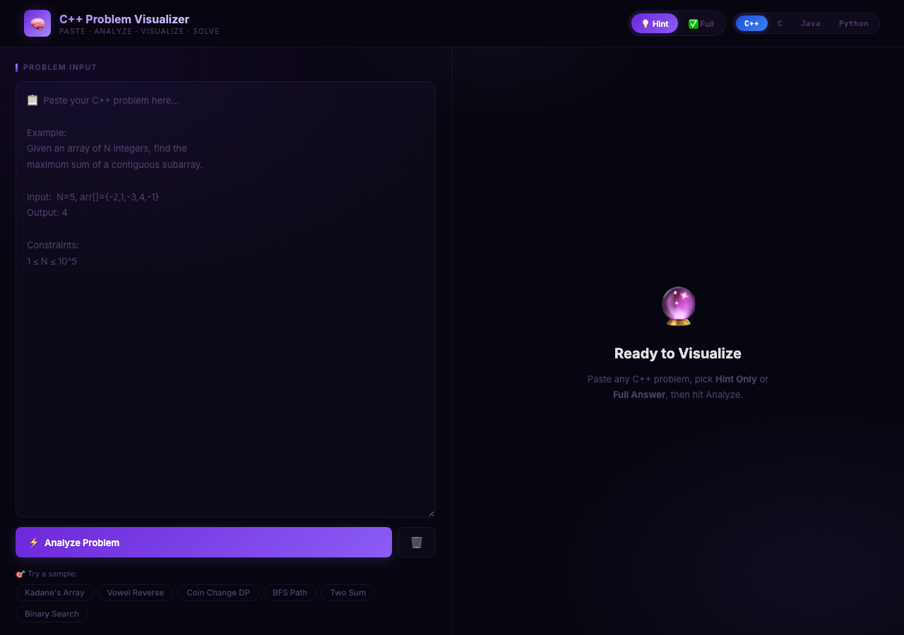
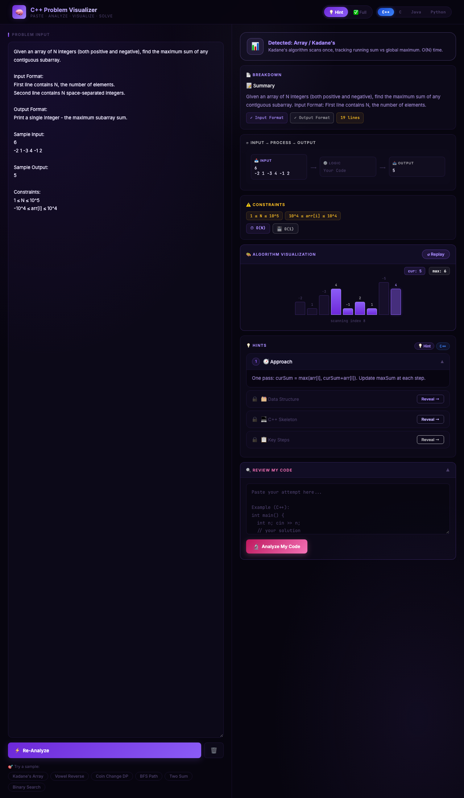
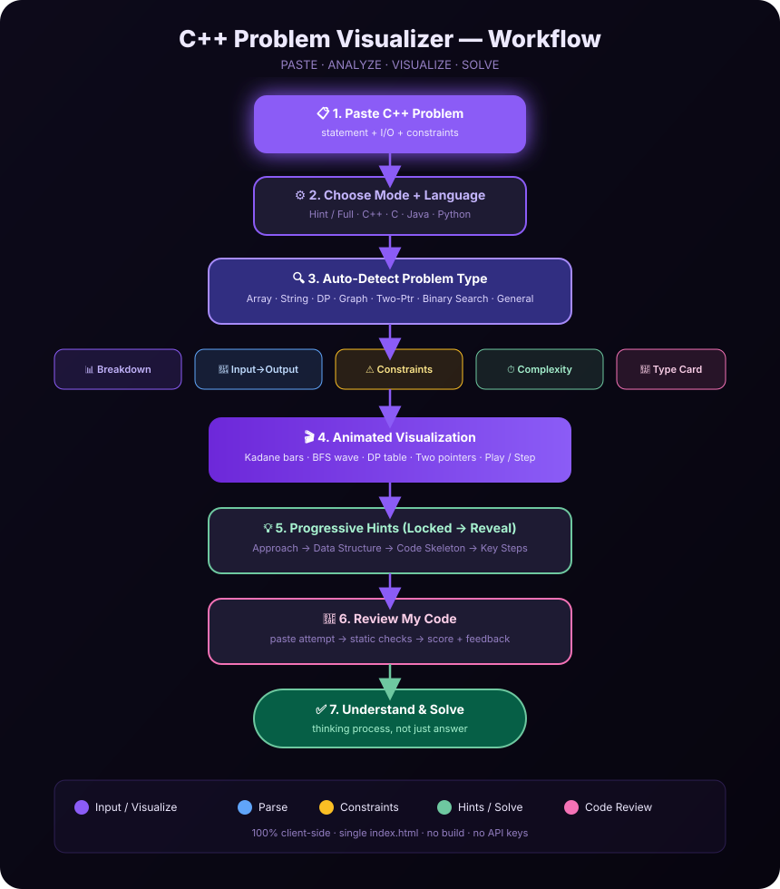
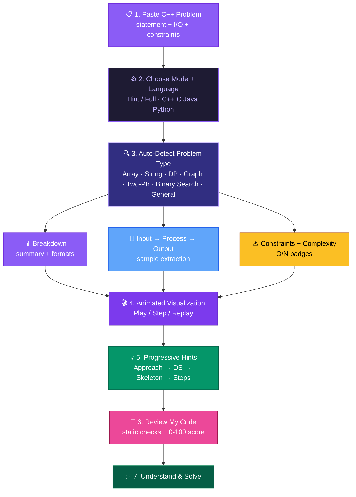

# C++ Problem Visualizer & Hint Engine 🧠

> An AI-style DSA learning platform that turns any programming problem into **interactive visualizations, progressive hints, solution strategies, and C++ code skeletons** — so you learn the *thinking process*, not just the answer.

Live demo: open `index.html` in any browser — no build step, no API keys, 100% client-side.



---

## ✨ What it does

Paste a C++ (or C / Java / Python) problem statement → the app:

1. **Detects the problem type** by keyword scoring (Array / String / DP / Graph / Two Pointers / Binary Search / General)
2. **Breaks it down** — summary, input/output format, sample I/O extraction, constraints + complexity badges
3. **Animates the algorithm** — step-through visualizations with Play / Step / Replay
4. **Guides with locked hints** — Approach → Data Structure → Code Skeleton → Key Steps (reveal one at a time)
5. **Reviews your code** — paste your attempt, get static checks, a 0–100 score and targeted feedback



*Above: Kadane's Array sample analyzed — type card, breakdown, Input → Process → Output, constraints, animated bar visualization, locked hints, and Review My Code.*

---

## 🖥️ Screenshots (working site)

| Paste a problem (empty state) | Full analysis (after Analyze) |
|---|---|
|  |  |

Files:

- `docs/screenshots/home-empty.png` — initial screen: problem input, Analyze button, sample chips, mode + language toggle
- `docs/screenshots/analysis-result.png` — after clicking a sample / Analyze: detected-type card, breakdown, I/O flow, constraints, algorithm visualization, hints, code review

Screenshots were captured headless in Chrome at 1280px from the actual `index.html` in this repo.

---

## 🔄 Workflow flowchart (colour)

### Option A — coloured diagram (image)



### Option B — coloured Mermaid flowchart (renders natively on GitHub)



Flow in words:

`Paste` → `Mode + Language` → `Detect type` → (`Breakdown` + `I/O flow` + `Constraints`) → `Animated visualization` → `Progressive hints` → `Code review` → `Solve with understanding`

---

## 🧩 Features in detail

### 1. Problem-type detection (`detectType`)
Keyword scoring over 7 buckets in `TYPES`:

| Type | Icon | Demo visualization |
|---|---|---|
| Dynamic Programming | 🔷 | Coin-change DP table fill (`coins=[1,5,6] amount=11`) |
| Graph / BFS | 🕸️ | BFS wave on 5 nodes, distance labels |
| Array / Kadane's | 📊 | Bar scan with `cur` / `max` pills |
| String / Two Pointer | 🔤 | Vowel-reverse with L/R pointers |
| Two Pointers | 👆 | Two-Sum on `[1,2,4,5,7]` target 9 |
| Sort + Binary Search | 🔢 | Binary search with eliminated ranges |
| General / Mixed | ⚙️ | Read → Valid? → Process flowchart |

### 2. Parsing
- `extractSection()` — pulls Input / Output / Sample blocks out of free text
- `extractConstraints()` — picks out lines with `≤ ≥ < >` or `10^`
- `getSummary()` — first meaningful lines for the Breakdown card; complexity badges (`O(N)`, `O(1)` etc.)

### 3. Visualizations (all animated, Play/Pause/Step)
- Array: Kadane bar animation
- Graph: SVG BFS with level colours
- DP: `dp[]` table with current-cell highlight
- String: character row with L/R pointer labels
- Two-pointer: array cells with found-state (green)
- Binary search: mid / active-range / eliminated states
- General: static SVG flowchart fallback

### 4. Progressive hints
Four locked cards per problem — **Approach → Data Structure → Code Skeleton → Key Steps**. Click `Reveal →` to unlock each one; content switches per selected language (`getLangCode()` / C++ / C / Java / Python with Prism highlighting).

### 5. Modes + languages
Header toggles: **💡 Hint** vs **✅ Full**, and **C++ / C / Java / Python**. Hint mode hides full solutions; language switch re-renders skeleton code blocks.

### 6. Review My Code
Paste your attempt → `syntaxCheck()` + `runReview()` → per-pattern regex checks (`REVIEW_PATTERNS`), approach/structure scoring (40 + 30 + …), progress bars and ✅/Missing lists. Works offline with zero backend.

### 7. One-click samples
`🎯 Try a sample:` chips — **Kadane's Array, Vowel Reverse, Coin Change DP, BFS Path, Two Sum, Binary Search** — each fills a full problem statement and auto-analyzes.

---

## 🚀 Run it

No dependencies. It's one file.

```bash
# clone
git clone https://github.com/aarush11tumbagi-source/cpp-problem-visualizer.git
cd cpp-problem-visualizer

# option 1 — just double-click index.html
open index.html

# option 2 — serve locally
python3 -m http.server 8000
# open http://localhost:8000
```

### Deploy to GitHub Pages (free hosting)
1. Push to `main` (this repo already is).
2. GitHub → **Settings → Pages** → Source: **Deploy from a branch**, Branch: `main`, Folder: `/ (root)`.
3. Open `https://<your-username>.github.io/cpp-problem-visualizer/`.

---

## 📁 Project structure

```text
cpp-problem-visualizer/
├── index.html                  # the entire app (CSS + JS inline, ~2800 lines)
├── README.md                   # this file
└── docs/
    ├── workflow.svg            # colour workflow flowchart
    └── screenshots/
        ├── home-empty.png      # empty / paste state
        └── analysis-result.png # full analysis state
```

Tech: plain HTML + CSS + vanilla JS, Google Fonts (Inter + JetBrains Mono), Prism Tomorrow theme via CDN for code highlighting. No framework, no build, no backend.

---

## 🤝 Contributing

Single-file app — edit `index.html` and refresh. Ideas welcome:

- More detectors (sliding window, heap, recursion trees)
- More languages (Go, Rust)
- Export visualization as GIF
- Real LLM hint backend (optional)

---

## 📜 License

MIT — learn, remix, teach.
